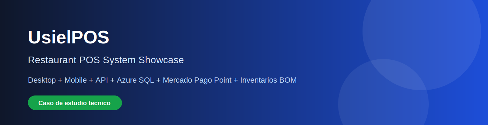
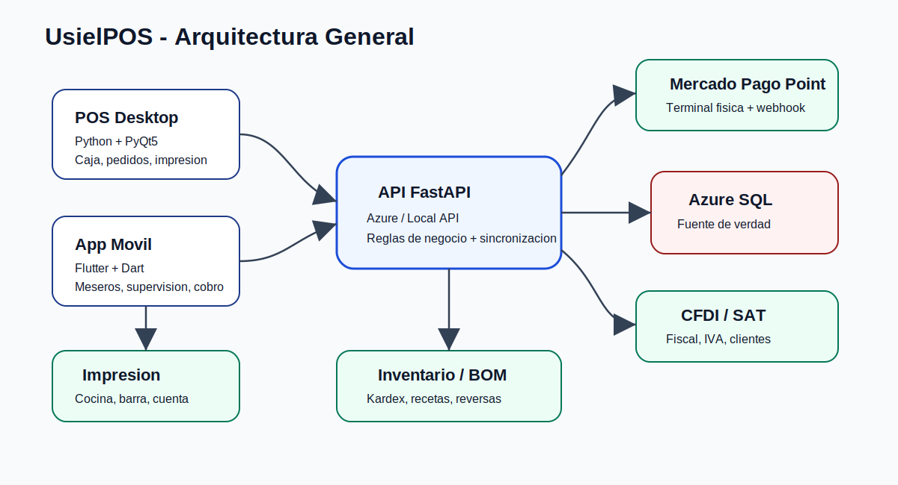
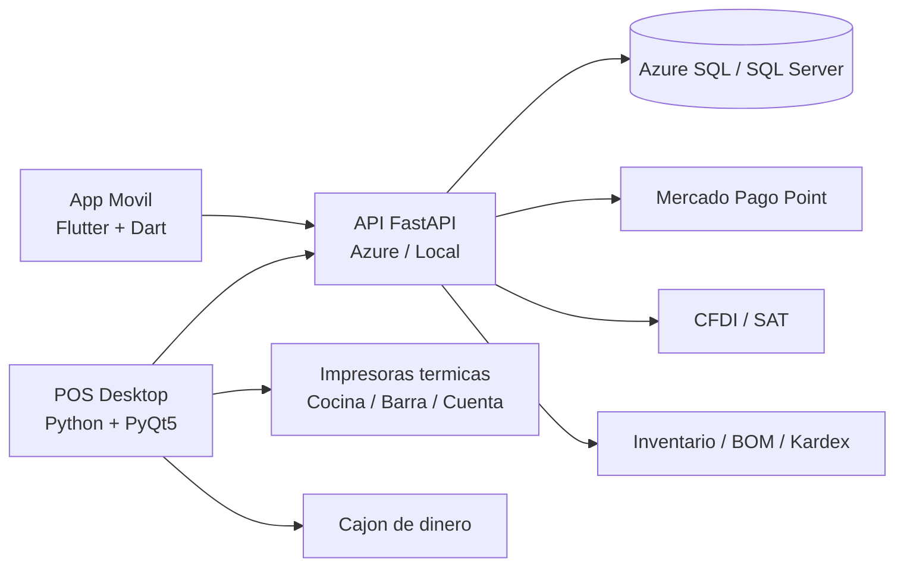

# UsielPOS - Restaurant POS System Showcase

> Caso de estudio tecnico de un ecosistema POS para restaurantes construido para operacion real.  
> Este repositorio **no contiene codigo fuente privado**. Presenta arquitectura, modulos, flujos, diagramas y evidencia visual del sistema.

## Resumen ejecutivo

**UsielPOS** es un sistema integral para restaurantes y negocios con una o varias sucursales. Cubre operacion de piso, comandas, cocina/barra, cobro, inventarios, auditoria, cortes, facturacion, supervision movil y pagos con terminal fisica **Mercado Pago Point**.

El sistema fue disenado como un ecosistema multi-dispositivo:

- **Aplicacion desktop** para caja, administracion, pedidos, cobro, inventarios, configuracion e impresion.
- **App movil Flutter** para meseros, supervisores y administradores.
- **API REST FastAPI** para sincronizar desktop, movil, nube, pagos y datos operativos.
- **Base de datos Azure SQL / SQL Server** como fuente principal de verdad.
- **Modo local/nube** para operar en red local o con API remota segun el escenario del cliente.

## Problema que resuelve

En restaurantes reales, el problema no es solo cobrar. El problema es controlar la operacion completa:

- Pedidos capturados dos veces.
- Errores entre meseros, cocina, barra y caja.
- Cancelaciones sin evidencia.
- Inventarios que no coinciden con ventas.
- Descuentos sin autorizacion.
- Corte de caja poco claro.
- Duenos sin visibilidad cuando no estan en la sucursal.
- Pagos con terminal desconectados del sistema.

UsielPOS convierte la operacion en un flujo trazable: **quien hizo que, cuando, desde donde y sobre que orden impacta**.

## Modulos principales

| Area | Funcionalidad |
|---|---|
| Operacion de piso | Salas, mesas, asignacion por mesero, PIN, estados en vivo |
| Pedidos | Comanda desktop y movil, envio a cocina/barra, paquetes y modificadores |
| Caja | Efectivo, tarjeta, mixto, pagos parciales, cambio, voucher por pago |
| Mercado Pago Point | Cobro desde desktop y movil, terminal fisica, estados, reintentos, idempotencia |
| Inventarios | Stock, kardex, recetas/BOM, conversiones, mermas, devoluciones |
| Auditoria | Cancelaciones, descuentos, autorizaciones, motivos, historial por usuario |
| Impresion | Cocina, barra, cuenta, voucher, cortes y apertura de cajon |
| Facturacion | Subtotal, IVA, clientes fiscales, emisor, ordenes marcadas para facturar |
| Supervision movil | Cortes, ventas, empleados, productos, inventario, historial y multisucursal |
| Administracion | Productos, paquetes, empleados, salas, mesas, precios y configuraciones |

## Arquitectura general

## Capturas de pantalla

Las capturas se deben agregar en la carpeta [`screenshots/`](screenshots/README.md). Se recomienda usar datos demo y ocultar informacion sensible.

| Pantalla | Archivo sugerido |
|---|---|
| Desktop - mesas/salas | `screenshots/desktop-mesas.png` |
| Desktop - pedidos | `screenshots/desktop-pedidos.png` |
| Desktop - cobro | `screenshots/desktop-cobro.png` |
| Desktop - inventario/kardex | `screenshots/desktop-inventario-kardex.png` |
| Movil - mesas | `screenshots/mobile-mesas.png` |
| Movil - pedidos | `screenshots/mobile-pedidos.png` |
| Movil - cobro | `screenshots/mobile-cobro.png` |
| Mercado Pago Point | `screenshots/mercadopago-point.png` |
| Facturacion / cortes | `screenshots/facturacion-o-cortes.png` |

## Integraciones destacadas

### Mercado Pago Point en desktop y app movil

El sistema permite enviar el monto de cobro directamente a una terminal fisica Mercado Pago Point desde el flujo de caja. La operacion se monitorea con estados internos, polling/webhook, reglas de bloqueo y aplicacion idempotente al POS para evitar duplicados.

Ver documentacion: [`docs/modulos/05-mercado-pago-point.md`](docs/modulos/05-mercado-pago-point.md)

### Inventarios inteligentes con recetas/BOM

Los productos pueden tener recetas compuestas por insumos, unidades y conversiones. Al enviar pedidos a cocina/barra se descuentan insumos; al cancelar se puede reversar con evidencia.

Ver documentacion: [`docs/modulos/06-inventarios-bom-kardex.md`](docs/modulos/06-inventarios-bom-kardex.md)

### Paquetes comerciales

Un paquete se vende como producto padre visible, pero internamente se desglosa en componentes reales para cocina/barra, inventario, cancelaciones y tickets.

Ver documentacion: [`docs/modulos/07-productos-paquetes-combos.md`](docs/modulos/07-productos-paquetes-combos.md)

### Modo local / nube

La app movil puede trabajar con API local dentro de la red del cliente o con API remota en la nube. Esto permite cubrir negocios con PC + movil, solo movil o supervision remota.

Ver documentacion: [`docs/modulos/12-modo-local-nube-multisucursal.md`](docs/modulos/12-modo-local-nube-multisucursal.md)

## Stack tecnologico

| Capa | Tecnologias |
|---|---|
| Desktop | Python, PyQt5, Qt, ESC/POS, Windows spooler, TCP 9100 |
| Mobile | Flutter, Dart, Riverpod, GoRouter, Dio, SharedPreferences |
| Backend | FastAPI, Pydantic, Uvicorn, REST APIs, webhooks |
| Datos | Azure SQL, SQL Server, SQLite local, PyODBC |
| Cloud | Azure App Service, Azure SQL, Docker, ACR/App Service workflow |
| Pagos | Mercado Pago Point API, terminal fisica, webhook/polling, idempotencia |
| Facturacion | CFDI/SAT, subtotal, IVA, clientes fiscales, emisor |
| Infraestructura | Modo local/nube, healthchecks, API embebida, descubrimiento local |
| Seguridad | Roles, PIN supervisor/admin, Bearer token, X-License, auditoria |

## Lo que demuestra este proyecto

- Capacidad para disenar sistemas reales de operacion comercial.
- Integracion entre desktop, movil, backend, nube, pagos, inventario e impresion.
- Manejo de reglas delicadas: cobros, cancelaciones, descuentos, inventario y auditoria.
- Pensamiento de producto: no solo codigo, sino operacion, soporte, escalabilidad y supervision.
- Arquitectura preparada para clientes con distintas formas de operacion: PC, movil, local, nube y multisucursal.

## Nota sobre el codigo fuente

El codigo fuente completo no se publica porque el sistema esta asociado a una solucion comercial y contiene logica de negocio privada. Este repositorio funciona como portafolio tecnico y documentacion de arquitectura.
