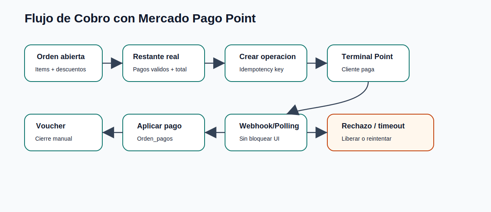

# Mercado Pago Point

## Objetivo

Integrar terminales fisicas Mercado Pago Point al flujo de cobro del POS, tanto en desktop como en app movil.

## Alcance

- Configuracion de credenciales y terminales.
- Seleccion de terminal default o multi-terminal.
- Envio de solicitud de cobro.
- Estados locales de operacion.
- Polling y webhook.
- Reintentos controlados.
- Aplicacion idempotente al POS.
- Separacion de propinas.
- Bloqueos seguros de orden.

## Estados locales

### Pendientes

- `CREATED`
- `PENDING`
- `AT_TERMINAL`
- `ACTION_REQUIRED`

### Finales

- `APPROVED`
- `FAILED`
- `CANCELED`
- `EXPIRED`
- `REFUNDED`

## Flujo principal

1. El usuario selecciona cobro con Point.
2. El backend calcula el restante real de la orden.
3. Se valida monto minimo y si hay operacion viva.
4. Se crea la operacion con referencia externa e idempotency key.
5. La terminal fisica recibe el monto.
6. El sistema consulta estado por polling o recibe webhook.
7. Si se aprueba, se registra pago en `orden_pagos`.
8. Si hay excedente/propina, se registra en `orden_propinas`.
9. Se libera la orden para impresion/cierre manual.

## Principios criticos

- La terminal no debe cerrar mesa automaticamente.
- Un `APPROVED` no aplicado al POS debe seguir bloqueando hasta aplicarse o resolverse.
- `AT_TERMINAL` requiere accion fisica en la terminal.
- Las operaciones deben ser idempotentes por referencia externa.
- Las propinas se separan del pago de la cuenta.

## Reintentos

Solo se permite reintento automatico para errores transitorios o saldo insuficiente permitido por regla. No debe reintentarse automaticamente cuando el rechazo es de seguridad, fraude, alto riesgo, cancelacion, expiracion o maximo de intentos.

## Valor tecnico

Esta integracion demuestra manejo de sistemas externos, asincronia, estados inconsistentes, webhooks, reintentos, seguridad y dinero real sin bloquear la operacion.
