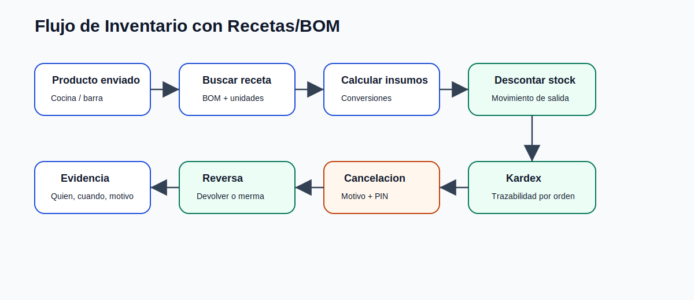

# Inventarios inteligentes, recetas BOM y kardex

## Objetivo

Conectar la venta con el consumo real de inventario.

## Conceptos

- Producto de venta.
- Producto inventariable.
- Receta/BOM.
- Insumo.
- Unidad y conversion.
- Movimiento de inventario.
- Kardex.
- Reversa por cancelacion.

## Flujo de consumo

1. Se envia un item a cocina/barra.
2. El backend revisa si tiene receta.
3. Calcula insumos y cantidades.
4. Valida stock disponible.
5. Registra movimientos de salida.
6. Guarda trazabilidad por orden/item.

## Cancelaciones

Cuando se cancela un item o una orden:

- Se pregunta si regresa a inventario cuando aplica.
- Se registra motivo.
- Se controla si requiere PIN.
- Se genera movimiento inverso si corresponde.
- Se evita doble devolucion.

## Paquetes

En paquetes, los hijos internos pueden detonar consumo real aunque el padre sea el visible para venta/cobro. Esto permite mantener control comercial y control operativo al mismo tiempo.

## Kardex

El kardex permite consultar:

- Entradas.
- Salidas.
- Consumos por orden.
- Cancelaciones.
- Devoluciones.
- Mermas.
- Ajustes.
- Stock minimo.

## Valor

El POS deja de ser solo caja y se convierte en herramienta de control operativo y administrativo.
