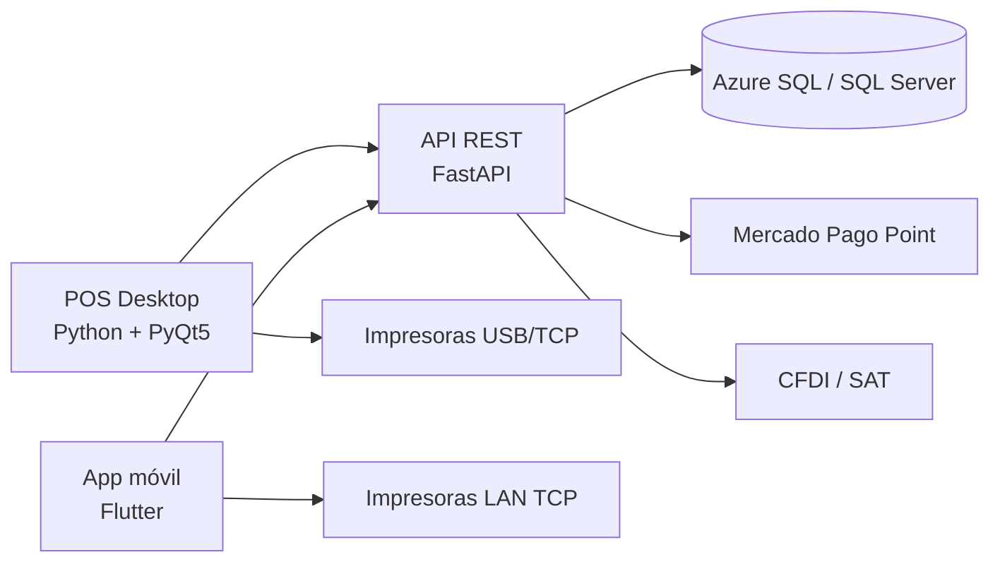

# Arquitectura general

UsielPOS fue diseñado como un ecosistema multi-dispositivo para operación de restaurantes. La arquitectura separa responsabilidades entre cliente desktop, app móvil, API REST y base de datos central.

## Objetivos de arquitectura

- Permitir operación desde PC y dispositivos móviles.
- Mantener una fuente de verdad en base de datos SQL.
- Soportar integración con servicios externos como Mercado Pago Point y CFDI.
- Evitar bloqueo de la operación por errores de impresión o conectividad.
- Separar roles: administrador, supervisor y mesero.
- Mantener trazabilidad en pagos, cancelaciones, inventario y cortes.

## Diagrama general

## Componentes

### POS Desktop

Aplicación principal para administración y operación interna del restaurante. Maneja módulos como pedidos, cobro, inventario, cortes, configuración de tickets, usuarios y facturación.

### App móvil

Aplicación Flutter enfocada en meseros y operación móvil. Permite consultar mesas, tomar pedidos, enviar a cocina/barra, cobrar, imprimir y operar con configuración local de impresoras.

### API REST

Backend central para exponer operaciones seguras a clientes móviles y sincronizar módulos. Implementado con FastAPI y preparado para operación local/nube.

### Base de datos

Azure SQL / SQL Server almacena órdenes, pagos, mesas, productos, inventario, recetas, usuarios, roles, configuración fiscal y trazabilidad operativa.

### Integraciones externas

- Mercado Pago Point para cobros con terminal física.
- CFDI/SAT para facturación.
- Impresoras térmicas mediante ESC/POS.

## Decisiones técnicas importantes

- Separación entre pago de orden y propina.
- Registro idempotente de pagos para evitar duplicados.
- Impresión local como proceso tolerante a fallos.
- Cancelaciones con trazabilidad y reversa de inventario.
- Manejo de productos visibles y componentes internos para paquetes.
- Uso de estados para operaciones de Point: pendiente, aprobada, cancelada, expirada o fallida.

