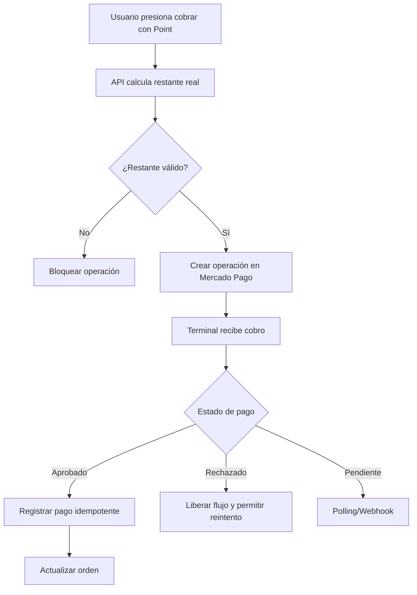

# Integración con Mercado Pago Point

Uno de los módulos más importantes del sistema es la integración con terminal física Mercado Pago Point.

## Objetivo

Permitir que el POS o la app móvil envíen un cobro directamente a una terminal física, monitoreen el resultado y apliquen el pago en el sistema solo cuando la operación fue aprobada.

## Flujo general

## Problemas resueltos

- Evitar duplicidad de pagos.
- No cerrar la mesa automáticamente al aprobar un cobro.
- Separar propina de pago de la cuenta.
- Permitir pagos mixtos y parciales.
- Manejar operaciones pendientes, canceladas, expiradas o rechazadas.
- Evitar bloqueos falsos si la terminal tarda en responder.
- Mantener registro auditable de operaciones externas.

## Estados utilizados

| Tipo | Estados |
|---|---|
| Pendientes | CREATED, PENDING, AT_TERMINAL, ACTION_REQUIRED |
| Finales | APPROVED, FAILED, CANCELED, EXPIRED, REFUNDED |

## Consideraciones de seguridad

- No exponer access tokens en repositorios.
- No subir capturas con IDs reales de operación.
- No documentar secretos de webhook.
- No mezclar operaciones reales con demos públicas.

