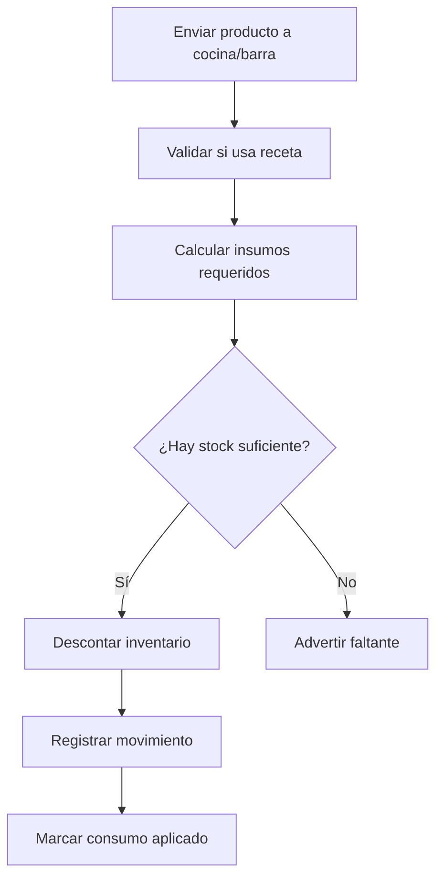
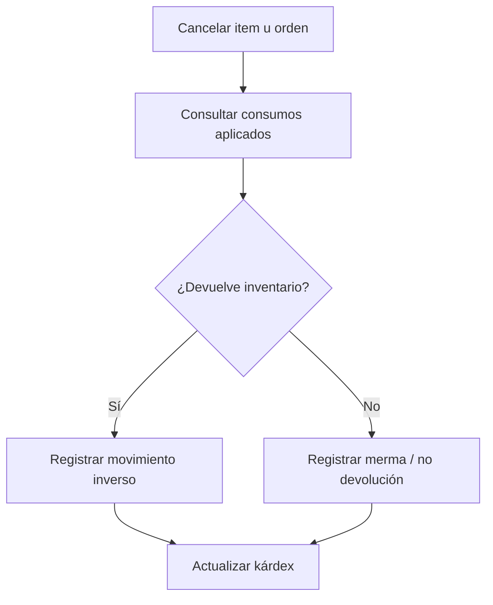

# Inventarios y recetas BOM

El sistema cuenta con inventario operativo y recetas BOM para descontar insumos automáticamente cuando se venden productos.

## Objetivo

Mantener control de stock real mediante movimientos trazables, consumo de insumos por receta y reversas cuando se cancelan productos u órdenes.

## Flujo de consumo

## Flujo de cancelación

## Características

- Stock por producto de inventario.
- Recetas por producto vendible.
- Conversión de unidades.
- Movimientos de entrada, salida y ajuste.
- Kárdex para trazabilidad.
- Reversas por cancelación.
- Soporte para paquetes con componentes internos.

